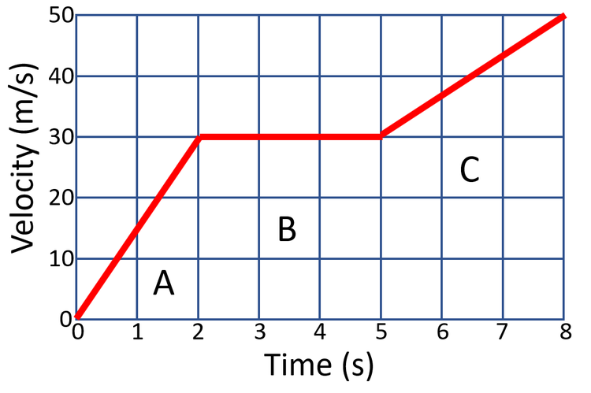
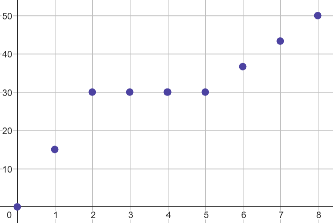
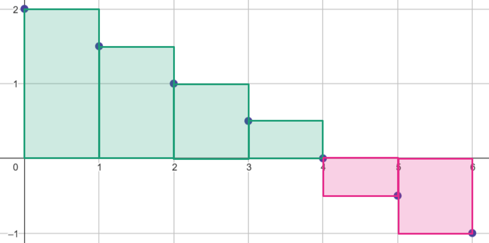

# Intro till Numerisk analys

## Bakgrund

På fysiken har vi ofta använt oss av st och vt-diagram för att beskriva rörelser. I vt-diagram kan vi läsa av hastigheten som funktion av tiden direkt. Men vi kan också få fram acceleration och sträckan vi rört oss.



### Acceleration

Acceleration är förändring av hastighet. Med en formelm $a=\frac{\Delta v}{\Delta t}$, i ett vt diagram motsvarar detta lutningen av grafen. (Jämför $k=\frac{\Delta y}{\Delta x}$)

### Sträcka

Om vi vill bestämma hur lång sträcka som något rört sig från ett vt-diagram motsvarar det arean under grafen. Ofta kan vi dela upp arean i ett antal enklare former vars area vi kan beräkna. Här är tex A, B och C en triangel, en rektangel och en parallelltrapets och den totala arean kan beräknas genom

$$A+B+C=\frac{2\cdot30}{2}+(5-2)\cdot 30 + \frac{30+50}{2}\cdot (8-5)=240\text{ m}$$

### Numeriska beräkningar

I verkliga tillämpningar får vi oftast inte fina vt-diagram där hastigheten beskrivs med en linjen. Istället så har vi något mätinstrument som mäter hastighet med ett visst tidsintervall. Om vi ritar ett vt-diagram skulle det kunna se ut så här


#### Acceleration
För att räkna ut accelerationen här är det mer partiskt att tänka oss datan som en serie av koordinater.

x[t] | y[v]
------- | -------
0 | 0
1 | 15
2 | 30
3 | 30
4 | 30
5 | 30
6 | 36.667
7 | 43.333
8 | 50

Då ges accelerationen under den första sekunden av $a=\frac{y_2 - y_1}{x_2 - x_1}=\frac{15 - 0}{1 - 0}$.

#### Sträcka 

För sträckan fungerar inte vårt tidigare trick att dela in arean under grafen i olika enklare former lägre.
Innan vi använder python för att beräkna sträckan baserat på punkternas koordinater är det bra att fundera hur vi skulle göra det för hand utan att kunna se vilka former vi kan dela upp området i.

Ett första försök skulle kunna vara att alltid dela in arean i rektanglar. En fördel med det är att arean av en rektangel är väldigt lätt att beräkna. En nackdel är att vårt svar kommer vara lite fel. Beroende på om vi väljer våra punkter som det övre högra eller vänstra hörnet så kommer den area vi beräknar att vara större eller minder än den verkliga arean. (I detta fall. För mer komplexa situationer kan vi inte alltid veta om svaret vi får är för stort eller litet.) Trots denna brist är denna metod ofta bra nog, så länge vi har ett tillräckligt kort intervall mellan varje mätning.

Om vi väljer att punkterna är övre högra hörnet i varje rektangel så ges arean för rektangel nr n av
$$A_n=y_{n+1} \cdot (x_{n+1} -x_n)$$
Att räkna ut avståndet i x-led mellan en punkt och den föregående kan kännas onödigt här där det alltid är 1, men i andra sammanhang kanske det inte är så enkelt. Avståndet behöver inte ens vara samma mellan alla punkter.

## Uppgift 0 Intro till Numpy

I den här uppgiften ska vi öva på hur en dator skulle kunna räkna ut acceleration och sträcka från en lista med punkter. Den del av matematiken där vi med en dator och faktiska nummer räknar ut saker brukar kallas numeriska metoder. Mer specifikt kallas det vi ska göra här numerisk analys.

För detta så kommer vi använda ett python paket som heter Numpy (numerical python).

- [ ] Börja med att installera numpy

I filen uppgift 0 så hittar du följande kod

```python
import numpy as np

x_värden = np.array([0,1,2,3,4,5,6,7,8])
y_värden = np.array([0,15,30,30,30,30,36.6667,43.3333,50])

```

Först så importerar vi numpy. Av tradition så kallas paketet alltid för np. Därefter så skapar vi två "listor" över punkterna i diagrammet ovans x och y koordinater. Det är dock inte vanliga listor utan numpy arrays som har några skillnader.

En viktig skillnad är att numpy hanterar matematiska operationer på arrays elementsvis.
Om vi skriver `print(x_värden+1)` så kommer numpy att lägga till 1 till varje värde i "listan".

I ren python hade motsvarande krävt en for-loop

```python
x_värden = [0,1,2,3,4,5,6,7,8]

for i in range(len(x_värden)):
    x_värden[i] = x_värden[i] + 1
```

### Acceleration

Om vi ska beräkna acceleration under varje sekund så vill vi ta $a=\frac{\Delta v}{\Delta t}=\frac{y_2 - y_1}{x_2 - x_1}$ för varje par av punkter. Med en for-loop kan vi beräkna $\Delta y$ så här

```python
y_värden = [0,15,30,30,30,30,36.6667,43.3333,50]
delta_y=[]
for i in range(len(y_värden)-1):
    delta= y_värden[i+1]-y_värden[i]
    delta_y.append(delta)    
```

- [ ] Fundera igenom varför vi behöver -1 vid range(len(y_värden)-1) i loopen.
- [ ] Vi har totalt 9 st y-värden. Hur många $\Delta y$ värden kommer vi få?

Genom att kombinera numpys elementsvisa operationer med pythons slicing så kan många beräkningar likt denna uttryckas väldigt enkelt. Ofta till och med på en enda rad.

```python
delta_y = y_värden[1:] - y_värden[:-1]  
```
Här betyder `y_värden[1:]` alla y värden efter det första, och `y_värden[:-1]` alla värden innan det sista.

- [ ] Använd numpy för att beräkna $\Delta y$, $\Delta x$ och sedan $a=\frac{\Delta v}{\Delta t}$

### Sträcka

Hur gör vi denna beräkning i kod? Vi vet redan att arean av en rektangel ges av
$$A_n=y_{n+1} \cdot (x_{n+1} -x_n)$$

Och att den totala arean bara är summan av alla rektanglar.

- [ ] Beräkna arean för varje rektangel med hjälp av numpy. (Även detta kan göras på en rad.)

När vi väl har en array med alla rektanglars area så kan vi använda funktionen `sum()` för att beräkna den totala arean.

### Area?
Är det verkligen arean av varje rektangel vi vill beräkna? Betrakta följande vt-diagram som beskriver ett föremål som först bromsar in med konstant acceleration från 2 m/s till 0 och sedan fortsätter med samma acceleration tills dess hastighet är 1 m/s i motsatt riktning. Hur lång sträcka rör sig föremålet under dessa 6 sekunder?


Svaret borde vara en kortare sträcka än om föremålet aldrig hade börjat backa. Bidraget från de två rektanglarna under x-axeln ska vara negativt. Om vi fortfarande vill räkna arean (som inte kan vara negativ) behöver vi dela upp det i två delar, en när hastigheten är positiv och en när den är negativ och räkna ut sträckan som $A_{total}=A_{+}-A_{-}$.

Detta verkar lite jobbigt. Som tur är fungerar den kod vi precis skrev utan några förändringar. Datorn vet inte att de vi räknade ut som $y_{n+1} \cdot (x_{n+1} -x_n)$ motsvarade en arean utan ser bara en multiplikation. Och de kan vara negativa.

- [ ] Beräkna sträckan som föremålet rör sig. Till din hjälp har du listorna över koordinaterna nedan.

```python
x_värden = np.array([0,1,2,3,4,5,6])
y_värden = np.array([2, 1.5, 1, 0.5, 0, -0.5, -1])
```

## Uppgift 1

För uppgift 1 har du fått en .txt fil med data från uppskjutningen av en Falcon 9 raket med utrustning till internationella rymdstationen. Filen innehåller tid från start, höjd över marken och raketens hastighet. Datan är hämtad från [denna](https://sjamthe.github.io/spacex-launch-analysis/) sida och kommer ursprungligen från Space X's stream. Värden togs ut medhjälp av python och OCR. En frame per sekund analyserades och det finns glapp i datan då inte alla frames lyckades läsas av.

Din uppgift är att beräkna hur många "g-krafter" man som mest utsätts för under uppskjutningen. För att göra detta behöver du räkna ut accelerationen överallt och sedan dela den med $g=9.8$ m/s.

## Uppgift 2

I uppgift 1 fick vi en funktion i form av en värdetabell. För tillämpningar så händer det att detta är
det enda sättet funktioner kan beskrivas, under Ma3 kommer vi dock oftare hantera funktioner som kan ges
som ett uttryck. I denna uppgift ska vi först arbeta med funktionen $f(x)=\frac{x^3+1}{x^2-1}$, den är
definierad för alla $x$ förutom $x=\pm 1$ och finns redan i filen uppgift 2.py.

### Lutning mellan punkter

För linjära funktioner ges lutningen av $k=\frac{y_2 - y_1}{x_2 - x_1}$. $f$ är dock inte linjär.
Vi kan dock prata om medellutning mellan två punkter, och denna ges av en snarlik formel $k=\frac{f(x_2 ) - f(x_1 )}{x_2 - x_1}$.

- [ ] Räkna ut medellutningen för funktion $f$ mellan $x=2$ och $x=4$.
- [ ] Skriv en funktion (i python) som räknar ut medellutningen om den får en funktion och x-värdena för de två punkterna.

### Lutning runt en punkt

Till skillnad från uppgift 1 där avståndet mellan mätpunkter bestämdes av något mätinstrument så är vi här helt fria att välja avståndet som vi beräknar medellutningen över. Om vi väljer ett väldigt litet avstånd så kan vi säga att den lutningen vi räknar ut är funktionens lutning i den punkten. Här är det värt att vara försiktig, punkter kan inte luta. Det vi gör när vi lite slarvigt säger lutning i en punkt är att vi approximerar funktionen i ett litet område runt punkten med en rät linje och anger lutningen på denna räta linje.

- [ ] Räkna ut medellutningen för funktion $f$ mellan $x=2$ och $x=2.1$.
- [ ] Med hjälp av en loop, räkna ut medellutningen för mindre och mindre intervall. Gå dock inte mindre än $10^{-12}$ då avrundningsfel
i flyttals beräkningar kommer börja påverka resultatet.
- [ ] Hur litet behöver intervallet vara för att du (i detta fall) ska kunna bestämma lutningen runt punkten med tre decimalers nogranhet?

## Uppgift 2.5

I samma fil finns det en funktion till definierad, $g(x)$. Vi ska nu undersöka hur den beter sig runt $x=2$.

- [ ] Räkna ut medellutningen för funktion $g$ mellan $x=2$ och $x=2.1$.
- [ ] Med hjälp av en loop, räkna ut medellutningen för mindre och mindre intervall.
- [ ] Räkna ut medellutningen för funktion $g$ mellan $x=1.9$ och $x=2$.
- [ ] Med hjälp av en loop, räkna ut medellutningen för mindre och mindre intervall.

## Uppgift 3

När vi vill bestämma arean under en graf kan vi också göra det genom att dela in området i många små delar och sen räkna varje del som en rektangel. För detta är det vanligt att vi vill skapa en lista med x-värden som är jämt fördelade över området vi är intresserade av. Med numpy görs detta med funktionen linespace.

```python
x_värden = np.linespace(1, 2, num=100) # Ger hundera värden jämt fördelade mellan 1 och 2.
```

I filen uppgift 3.py finns funktionen $h(x)=\sqrt{1-x^2}$ definierad. Denna funktion beskriver en halvcirkel med radien 1. Detta betyder att arean under grafen ska vara $\frac{1^2 \pi}{2}$.

- [ ] Skapa en lista med 100 x-värden mellan -1 och 1 och räkna ut arean med dessa som bas. Hur stort blir ditt fel?
- [ ] 